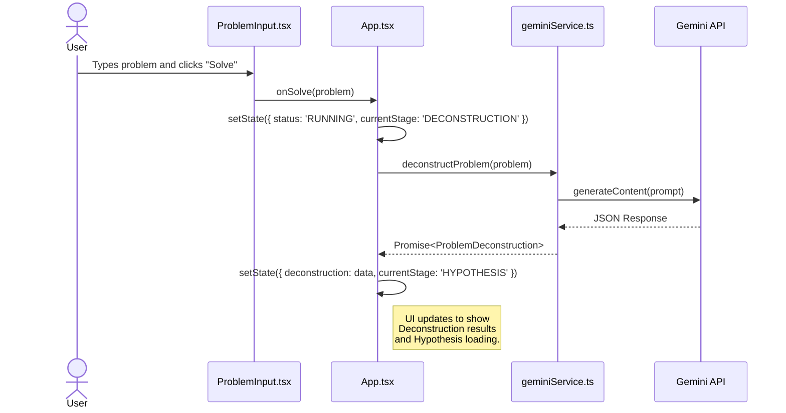

# 🌍 OMEGA — The Universal Problem-Solving Engine
> An AI civilization that generates hypotheses, debates, and builds solutions — for *any* problem in the world. 🚀

---

![OMEGA Banner](data:image/svg+xml;base64,PHN2ZyB3aWR0aD0iODAwIiBoZWlnaHQ9IjIwMCIgdmlld0JveD0iMCAwIDgwMCAyMDAiIHhtbG5zPSJodHRwOi8vd3d3LnczLm9yZy8yMDAwL3N2ZyIgc3R5bGU9ImJhY2tncm91bmQtY29sb3I6IzAyMDYxNzsiPgogIDxzdHlsZT4KICAgIC50aXRsZSB7IGZvbnQtZmFtaWx5OiAnU3BhY2UgR3JvdGVzaycsIHNhbnMtc2VyaWY7IGZvbnQtc2l6ZTogNjBweDsgZm9udC1zd2VpZ2h0OiBib2xkOyBmaWxsOiB1cmwoI2dyYWQpOyB9CiAgICAuc3VidGl0bGUgeyBmb250LWZhbWlseTogJ1NwYWNlIEdyb3Rlc2snLCBzYW5zLXNlcmlmOyBmb250LXNpemU6IDIwcHg7IGZpbGw6ICM5NGEzYjg7IH0KICAgIC5sb2dvIHsgc3Ryb2tlOiAjMjJkM2VlOyBzdHJva2Utd2lkdGg6IDIuNTsgZmlsbDogbm9uZTsgfQogICAgLmxvZ28tZ2xvdyB7IGZpbHRlcjogZHJvcC1zaGFkb3coMCAwIDhweCAjMjJkM2VlKTsgfQogIDwvc3R5bGU+CiAgPGRlZnM+CiAgICA8bGluZWFyR3JhZGllbnQgaWQ9ImdyYWQiIHgxPSIwJSIgeTE9IjAlIiB4Mj0iMTAwJSIgeTI9IjAlIj4KICAgICAgPHN0b3Agb2Zmc2V0PSIwJSIgc3R5bGU9InN0b3AtY29sb3I6I2UyZThmMDtzdG9wLW9wYWNpdHk6MSIgLz4KICAgICAgPHN0b3Agb2Zmc2V0PSIxMDAlIiBzdHlsZT0ic3RvcC1jb2xvcjojMjJkM2VlO3N0b3Atb3BhY2l0eToxIiAvPgogICAgPC9saW5lYXJHcmFkaWVudD4KICA8L2RlZnM+CiAgPGcgY2xhc3M9ImxvZ28tZ2xvdyIgdHJhbnNmb3JtPSJ0cmFuc2xhdGUoMTAwLCAxMDApIHNjYWxlKDIuNSkiPgogICAgPHBhdGggY2xhc3M9ImxvZ28iIHN0cm9rZS1saW5lY2FwPSJyb3VuZCIgc3Ryb2tlLWxpbmVqb2luPSJyb3VuZCIgZD0iTTQuNSAxMi43NWw3LjUtNy41IDcuNSA3LjVtLTE1IDMuMzc1bDcuNS03LjUgNy41IDcuNSIgLz4KICAgIDxwYXRoIGNsYXNzPSJsb2dvIiBkPSJNMTIgMjFhOSA5IDAgMTAwLTE4IDkgOSAwIDAwMCAxOHoiIHN0cm9rZS1vcGFjaXR5PSIwLjUiIC8+CiAgPC9nPgogIDx0ZXh0IHg9IjIwMCIgeT0iOTUiIGNsYXNzPSJ0aXRsZSI+T01FR0E8L3RleHQ+CiAgPHRleHQgeD0iMjAwIiB5PSIxMzAiIGNsYXNzPSJzdWJ0aXRsZSI+VGhlIFVuaXZlcnNhbCBQcm9ibGVtLVNvbHZpbmcgRW5naW5lPC90ZXh0Pgo8L3N2Zz4=)

## 📖 Introduction

OMEGA is a sophisticated AI-powered system designed to tackle complex, real-world challenges. It simulates an ecosystem of specialized AI agents that systematically deconstruct problems, debate potential solutions, and synthesize comprehensive strategies.

This demonstration showcases OMEGA's capability by tasking it with designing a novel carbon capture material, highlighting its potential to accelerate scientific discovery and innovation. ⚛️

---

## ✨ Core Features

*   **🧠 Multi-Agent Reasoning**: Simulates a team of AI experts (scientist, engineer, etc.) who collaborate to solve problems.
*   **⚙️ 4-Stage Cognitive Pipeline**: A structured process taking a problem from analysis to a full solution blueprint.
*   **🎨 Multi-Theme UI**: Five beautiful pastel and dark themes to customize your experience.
*   **💬 Persistent Chat Assistant**: An integrated AI assistant with different modes and saved chat history.
*   **🚀 Dynamic & Responsive Frontend**: Built with React & TailwindCSS to visualize the entire problem-solving process.

---

## 💻 How It Works

OMEGA is engineered around a four-stage cognitive pipeline. This structure ensures every problem is approached with rigor, creativity, and a focus on practical outcomes.

```ascii
[ User Problem 📝 ]
       |
       v
+-------------------------+
| 🔬 1. DECONSTRUCTION    |
|   - Key Variables       |
|   - Constraints         |
|   - Desired Outcomes    |
+-------------------------+
       |
       v
+-------------------------+
| 💡 2. HYPOTHESIS        |
|   - Scientific          |
|   - Engineering         |
|   - Policy / Social     |
+-------------------------+
       |
       v
+-------------------------+
| 💬 3. MULTI-AGENT DEBATE|
|   - Agents Critique     |
|   - Refine Ideas        |
|   - Build Consensus     |
+-------------------------+
       |
       v
+-------------------------+
| 📜 4. SOLUTION SYNTHESIS|
|   - Final Blueprint     |
|   - Impact Analysis     |
|   - Next Steps & Risks  |
+-------------------------+
       |
       v
[ ✅ Final Solution ]
```

The **Multi-Agent Debate** is the core of OMEGA's reasoning, where specialized agents collaborate to refine ideas.

```ascii
+-------------------------------------------------------------+
|                     INSIDE THE DEBATE STAGE                   |
+-------------------------------------------------------------+
|                                                             |
|   [Hypothesis 1] ---> Critique & Refine ---> [Refined H1]   |
|   [Hypothesis 2] ---> Critique & Refine ---> [Refined H2]   |
|   [Hypothesis 3] ---> Critique & Refine ---> [Refined H3]   |
|                                                             |
|        ^                 |                    ^             |
|        |                 v                    |             |
|        |           +--------------+           |             |
| +--------------+   |  Simulation  |   +-----------------+   |
| |  Scientist   | <-> |  (Dr. Orion) | <-> |  Impact Analyst |   |
| | (Dr. Elara)  |   +--------------+   |     (Riva)      |   |
| +--------------+           ^          +-----------------+   |
|        ^                   |                    ^             |
|        |           +--------------+           |             |
|        +-----------|   Engineer   |-----------+             |
|                    |    (Kairo)   |                         |
|                    +--------------+                         |
|                                                             |
|            -- Collective Consensus Forms -->                |
+-------------------------------------------------------------+
```

---

## 🏛️ Architecture Deep Dive

OMEGA is a modern, serverless-first application. The entire system runs in the browser, making powerful, orchestrated calls to the Gemini API.

### State Management Flow 🌊

The application's core logic is managed by a state machine that progresses through defined statuses and stages, ensuring a predictable and robust user experience.

```mermaid
graph TD
    subgraph "Application State Lifecycle"
        IDLE -- "User inputs problem" --> RUNNING;
        RUNNING -- "API calls successful" --> COMPLETED;
        RUNNING -- "API call fails" -- ZAP --> ERROR;
        COMPLETED -- "User resets" --> IDLE;
        ERROR -- "User resets" --> IDLE;
    end

    subgraph "Stage Progression (while RUNNING)"
        direction LR
        S1[DECONSTRUCTION] --> S2[HYPOTHESIS];
        S2 --> S3[DEBATE];
        S3 --> S4[SYNTHESIS];
    end

    style IDLE fill:#4b5563,stroke:#9ca3af,color:#fff
    style RUNNING fill:#0891b2,stroke:#22d3ee,color:#fff
    style COMPLETED fill:#166534,stroke:#22c55e,color:#fff
    style ERROR fill:#991b1b,stroke:#f87171,color:#fff
```

### Component Architecture 🏗️

The user interface is built with React. A main `App` component manages state and orchestrates the rendering of UI and content components.

```mermaid
graph TD
    subgraph "Frontend Architecture"
        direction TB

        subgraph "State & Logic"
            App[App.tsx <br/><i>(Main State, API Calls)</i>]
        end

        subgraph "UI Shell"
            ThemeSwitcher[ThemeSwitcher.tsx]
            Chatbot[Chatbot.tsx]
            ProblemInput[ProblemInput.tsx]
            ArchitectureShowcase[ArchitectureShowcase.tsx]
        end

        subgraph "Dynamic Stages"
            StageDisplay[StageDisplay.tsx]
            StageCard[StageCard.tsx]
            Decon[DeconstructionContent.tsx]
            Hypo[HypothesesContent.tsx]
            Debate[AgentDebateContent.tsx]
            Solution[SolutionContent.tsx]
        end
        
        App --> ProblemInput
        App --> ArchitectureShowcase
        App --> ThemeSwitcher
        App --> Chatbot
        App --> StageDisplay

        StageDisplay --> StageCard
        StageCard --> Decon
        StageCard --> Hypo
        StageCard --> Debate
        StageCard --> Solution
    end
```

### Data Flow (Single Stage Example) ➡️

This sequence diagram illustrates how the UI, service layer, and Gemini API interact during the first stage of the process. This pattern repeats for each subsequent stage.



### Gemini API Integration 🤖

The `geminiService.ts` module is the bridge to the AI's intelligence. Carefully crafted prompts leverage Gemini's JSON mode, model selection, and tool usage to orchestrate the entire pipeline.

```mermaid
graph TD
    subgraph "Browser Client"
        A[React UI] --> |User Actions| B[geminiService.ts];
    end

    subgraph "Google AI Platform"
        M1[gemini-2.5-flash <br/><i>(JSON Mode for Structure)</i>]
        M2[gemini-2.5-pro <br/><i>(Advanced Reasoning)</i>]
        M3[gemini-2.5-flash <br/><i>(w/ Google Search Tool)</i>]
    end
    
    B -- "Deconstruct & Hypothesize" --> M1;
    B -- "Debate & Synthesize" --> M2;
    B -- "Chat (Grounding Mode)" --> M3;

    M1 -- "Structured JSON" --> B;
    M2 -- "Structured JSON" --> B;
    M3 -- "Streamed Response w/ Sources" --> B;

    B -- "Renders State Updates" --> A;
```

---

## 🛠️ Tech Stack

### Key Technologies


<br/>

---

## 🔮 The Future of OMEGA

This project serves as a powerful proof-of-concept for a much grander vision: a globally distributed, autonomous reasoning civilization. Imagine a future where OMEGA could:

-   🧠 Leverage specialized hardware for massive simulations.
-   🧪 Integrate with physical labs to run real-world experiments.
-   📈 Continuously learn and evolve its own cognitive architecture.

We believe OMEGA represents a new paradigm for human-AI collaboration, and we're excited to see where this journey takes us. ✨
