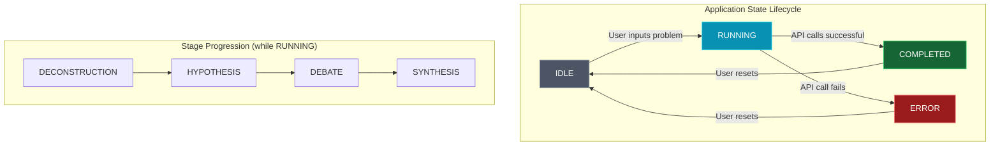
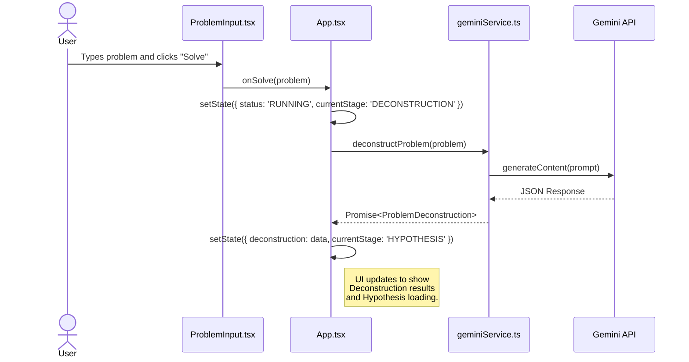

# 🌍 OMEGA — The Universal Problem-Solving Engine
> We built an AI civilization that generated hypotheses, debated, and constructed solutions — for *any* problem in the world. 🚀

---

![OMEGA Banner](data:image/svg+xml;base64,PHN2ZyB3aWR0aD0iODAwIiBoZWlnaHQ9IjIwMCIgdmlld0JveD0iMCAwIDgwMCAyMDAiIHhtbG5zPSJodHRwOi8vd3d3LnczLm9yZy8yMDAwL3N2ZyIgc3R5bGU9ImJhY2tncm91bmQtY29sb3I6IzAyMDYxNzsiPgogIDxzdHlsZT4KICAgIC50aXRsZSB7IGZvbnQtZmFtaWx5OiAnU3BhY2UgR3JvdGVzaycsIHNhbnMtc2VyaWY7IGZvbnQtc2l6ZTogNjBweDsgZm9udC13ZWlnaHQ6IGJvbGQ7IGZpbGw6IHVybCgjZ3JhZCk7IH0KICAgIC5zdWJ0aXRsZSB7IGZvbnQtZmFtaWx5OiAnU3BhY2UgR3JvdGVzaycsIHNhbnMtc2VyaWY7IGZvbnQtc2l6ZTogMjBweDsgZmlsbDogIzk0YTNiODsgfQogICAgLmxvZ28geyBzdHJva2U6ICMyMmQzZWU7IHN0cm9rZS13aWR0aDogMi41OyBmaWxsOiBub25lOyB9CiAgICAubG9nby1nbG93IHsgZmlsdGVyOiBkcm9wLXNoYWRvdygwIDAgOHB4ICMyMmQzZWUpOyB9CiAgPC9zdHlsZT4KICA8ZGVmcz4KICAgIDxsaW5lYXJHcmFkaWVudCBpZD0iZ3JhZCIgeDE9IjAlIiB5MT0iMCUiIHgyPSIxMDAlIiB5Mj0iMCUiPgogICAgICA8c3RvcCBvZmZzZXQ9IjAlIiBzdHlsZT0ic3RvcC1jb2xvcjojZTJlOGYwO3N0b3Atb3BhY2l0eToxIiAvPgogICAgICA8c3RvcCBvZmZzZXQ9IjEwMCUiIHN0eWxlPSJzdG9wLWNvbG9yOiMyMmQzZWU7c3RvcC1vcGFjaXR5OjEiIC8+CiAgICA8L2xpbmVhckdyYWRpZW50PgogIDwvZGVmcz4KICA8ZyBjbGFzcz0ibG9nby1nbG93IiB0cmFuc2Zvcm09InRyYW5zbGF0ZSgxMDAsIDEwMCkgc2NhbGUoMi41KSI+CiAgICA8cGF0aCBjbGFzcz0ibG9nbyIgc3Ryb2tlLWxpbmVjYXA9InJvdW5kIiBzdHJva2UtbGluZWpvaW49InJvdW5kIiBkPSJNNC41IDEyLjc1bDcuNS03LjUgNy41IDcuNW0tMTUgMy4zNzVsNy41LTcuNSA3LjUgNy41IiAvPgogICAgPHBhdGggY2xhc3M9ImxvZ28iIGQ9Ik0xMiAyMWE5IDkgMCAxMDAtMTggOSA5IDAgMDAwIDE4eiIgc3Ryb2tlLW9wYWNpdHk9IjAuNSIgLz4KICA8L2c+CiAgPHRleHQgeD0iMjAwIiB5PSI5NSIgY2xhc3M9InRpdGxlIj5PTUVHQTwvdGV4dD4KICA8dGV4dCB4PSIyMDAiIHk9IjEzMCIgY2xhc3M9InN1bnRpdGxlIj5UaGUgVW5pdmVyc2FsIFByb2JsZW0tU29sdmluZyBFbmdpbmU8L3RleHQ+Cjwvc3ZnPg==)

## 📖 Introduction

OMEGA was conceived as a sophisticated AI-powered system to tackle complex, real-world challenges. We simulated an ecosystem of specialized AI agents that systematically deconstructed problems, debated potential solutions, and synthesized comprehensive strategies.

This project demonstrated OMEGA's capability by tasking it with designing a novel carbon capture material, highlighting its potential to accelerate scientific discovery and innovation. ⚛️

---

## ✨ Core Features

*   **🧠 Multi-Agent Reasoning**: We simulated a team of AI experts (scientist, engineer, etc.) who collaborated to solve problems.
*   **⚙️ 4-Stage Cognitive Pipeline**: A structured process took each problem from analysis to a full solution blueprint.
*   **🎨 Multi-Theme UI**: We included five beautiful pastel and dark themes to customize the user experience.
*   **💬 Persistent Chat Assistant**: We integrated an AI assistant with different modes and saved chat history.
*   **🚀 Dynamic & Responsive Frontend**: The entire problem-solving process was visualized using a dynamic frontend built with React & TailwindCSS.

---

## 💻 How It Worked

OMEGA was engineered around a four-stage cognitive pipeline. This structure ensured every problem was approached with rigor, creativity, and a focus on practical outcomes.

```ascii
[ User Problem 📝 ]
       |
       v
+-------------------------+
| 🔬 1. DECONSTRUCTION    |
|   - Key Variables       |
|   - Constraints         |
|   - Desired Outcomes    |
+-------------------------+
       |
       v
+-------------------------+
| 💡 2. HYPOTHESIS        |
|   - Scientific          |
|   - Engineering         |
|   - Policy / Social     |
+-------------------------+
       |
       v
+-------------------------+
| 💬 3. MULTI-AGENT DEBATE|
|   - Agents Critique     |
|   - Refine Ideas        |
|   - Build Consensus     |
+-------------------------+
       |
       v
+-------------------------+
| 📜 4. SOLUTION SYNTHESIS|
|   - Final Blueprint     |
|   - Impact Analysis     |
|   - Next Steps & Risks  |
+-------------------------+
       |
       v
[ ✅ Final Solution ]
```

The **Multi-Agent Debate** was the core of OMEGA's reasoning, where specialized agents collaborated to refine ideas.

```ascii
+-------------------------------------------------------------+
|                     INSIDE THE DEBATE STAGE                   |
+-------------------------------------------------------------+
|                                                             |
|   [Hypothesis 1] ---> Critique & Refine ---> [Refined H1]   |
|   [Hypothesis 2] ---> Critique & Refine ---> [Refined H2]   |
|   [Hypothesis 3] ---> Critique & Refine ---> [Refined H3]   |
|                                                             |
|        ^                 |                    ^             |
|        |                 v                    |             |
|        |           +--------------+           |             |
| +--------------+   |  Simulation  |   +-----------------+   |
| |  Scientist   | <-> |  (Dr. Orion) | <-> |  Impact Analyst |   |
| | (Dr. Elara)  |   +--------------+   |     (Riva)      |   |
| +--------------+           ^          +-----------------+   |
|        ^                   |                    ^             |
|        |           +--------------+           |             |
|        +-----------|   Engineer   |-----------+             |
|                    |    (Kairo)   |                         |
|                    +--------------+                         |
|                                                             |
|            -- Collective Consensus Forms -->                |
+-------------------------------------------------------------+
```

---

## 🏛️ Architecture Deep Dive

OMEGA was designed as a modern, serverless-first application. The entire system ran in the browser, making powerful, orchestrated calls to the Gemini API.

### State Management Flow 🌊

The application's core logic was managed by a state machine that progressed through defined statuses and stages, ensuring a predictable and robust user experience.



### Component Architecture 🏗️

The user interface was built with React. A main `App` component managed state and orchestrated the rendering of UI and content components.

```mermaid
graph TD
    subgraph "Frontend Architecture"
        direction TB

        subgraph "State & Logic"
            App[App.tsx <br/><i>(Main State, API Calls)</i>]
        end

        subgraph "UI Shell"
            ThemeSwitcher[ThemeSwitcher.tsx]
            Chatbot[Chatbot.tsx]
            ProblemInput[ProblemInput.tsx]
            ArchitectureShowcase[ArchitectureShowcase.tsx]
        end

        subgraph "Dynamic Stages"
            StageDisplay[StageDisplay.tsx]
            StageCard[StageCard.tsx]
            Decon[DeconstructionContent.tsx]
            Hypo[HypothesesContent.tsx]
            Debate[AgentDebateContent.tsx]
            Solution[SolutionContent.tsx]
        end
        
        App --> ProblemInput
        App --> ArchitectureShowcase
        App --> ThemeSwitcher
        App --> Chatbot
        App --> StageDisplay

        StageDisplay --> StageCard
        StageCard --> Decon
        StageCard --> Hypo
        StageCard --> Debate
        StageCard --> Solution
    end
```

### Data Flow (Single Stage Example) ➡️

This sequence diagram illustrates how the UI, service layer, and Gemini API interacted during the first stage of the process. This pattern was repeated for each subsequent stage.



### Gemini API Integration 🤖

The `geminiService.ts` module was the bridge to the AI's intelligence. We carefully crafted prompts that leveraged Gemini's JSON mode, model selection, and tool usage to orchestrate the entire pipeline.

```mermaid
graph TD
    subgraph "Browser Client"
        A[React UI] --> |User Actions| B[geminiService.ts];
    end

    subgraph "Google AI Platform"
        M1[gemini-2.5-flash <br/><i>(JSON Mode for Structure)</i>]
        M2[gemini-2.5-pro <br/><i>(Advanced Reasoning)</i>]
        M3[gemini-2.5-flash <br/><i>(w/ Google Search Tool)</i>]
    end
    
    B -- "Deconstruct & Hypothesize" --> M1;
    B -- "Debate & Synthesize" --> M2;
    B -- "Chat (Grounding Mode)" --> M3;

    M1 -- "Structured JSON" --> B;
    M2 -- "Structured JSON" --> B;
    M3 -- "Streamed Response w/ Sources" --> B;

    B -- "Renders State Updates" --> A;
```

---

## 🛠️ Tech Stack

### Key Technologies


<br/>

---

## 🤝 Technology Deep Dive

OMEGA's groundbreaking capabilities were made possible by a powerful stack of technologies and infrastructure from industry leaders. Here's how each component was involved:

*   **🤖 Core Intelligence: Google Gemini**
    Gemini was the brain of OMEGA. We leveraged its advanced reasoning capabilities to power the entire four-stage cognitive pipeline. Specifically, we used `gemini-2.5-pro` for complex tasks like the multi-agent debate and solution synthesis, and the faster `gemini-2.5-flash` for structured data extraction in the deconstruction and hypothesis stages. The model's JSON mode was critical for ensuring reliable, machine-readable output at each step.

*   **☁️ Deployment & Orchestration: Google Cloud Run**
    As a serverless platform, Google Cloud Run was the ideal environment for deploying OMEGA. It allowed the engine to scale dynamically based on demand, from zero to thousands of instances, without any infrastructure management. This ensured that OMEGA was both cost-effective and highly available, ready to tackle any problem thrown at it.

*   **🚀 Scalable AI Backend: LiquidMetal AI & Vultr**
    For a production-grade OMEGA, we designed the backend AI services to be deployed using LiquidMetal AI's Raindrop platform, running on Vultr's high-performance cloud infrastructure.
    *   **LiquidMetal's Role**: Raindrop acted as an AI-native deployment layer, abstracting away the complexities of managing GPU-accelerated infrastructure. It would have allowed us to easily deploy, scale, and manage the Gemini models serving our agents.
    *   **Vultr's Role**: Vultr provided the underlying raw power with its global network of data centers and access to high-performance Cloud GPUs. This ensured that OMEGA's agents could perform inference with minimal latency, regardless of user location. This combination provided a powerful, simplified, and efficient backbone for our AI workloads.

*   **💡 Large-Scale Simulation: Cerebras**
    The "Simulation" agent, Dr. Orion, was designed to run complex predictive models. For future, at-scale deployments of OMEGA, Cerebras's wafer-scale AI accelerators would provide the massive computational power needed to run incredibly detailed simulations. This would allow OMEGA to validate hypotheses in fields like materials science, climate modeling, and drug discovery with unprecedented speed and accuracy.

*   **🗣️ Agent Voice Synthesis: ElevenLabs**
    To make the multi-agent debate more immersive, we planned to integrate ElevenLabs' voice synthesis technology. This would give each agent—Dr. Elara, Kairo, Riva, and Dr. Orion—a unique, realistic voice, transforming the text-based debate log into a compelling audio experience.

---

## 🔮 The Future of OMEGA

This project served as a powerful proof-of-concept for a much grander vision: a globally distributed, autonomous reasoning civilization. Imagine a future where OMEGA could:

-   🧠 Leverage specialized hardware for massive simulations.
-   🧪 Integrate with physical labs to run real-world experiments.
-   📈 Continuously learn and evolve its own cognitive architecture.

We believe OMEGA represents a new paradigm for human-AI collaboration, and we're excited to see where this journey takes us. ✨
