# 🌍 OMEGA — The Universal Problem-Solving Engine
> We built an AI civilization that generates hypotheses, debates, and builds solutions — for *any* problem in the world.

---


## 🏆 Our Hackathon Story

For the Google Cloud Run Hackathon, we embarked on an ambitious mission: to build **OMEGA**, a serverless AI system that could tackle complex, real-world problems. We wanted to go beyond simple Q&A and create a tool that could reason, innovate, and collaborate.

OMEGA was designed as a living AI ecosystem, orchestrating a team of specialized AI agents to systematically deconstruct a problem, debate potential solutions, and synthesize a comprehensive final answer.

**Our demonstration use-case**: We challenged OMEGA to design a novel carbon capture material, showcasing its power to accelerate scientific discovery. ⚛️

---

## ✨ Core Features

*   **🧠 Multi-Agent Reasoning**: OMEGA simulates a team of AI experts (a scientist, an engineer, an impact analyst, and a simulation expert) who collaborate to solve problems.
*   **⚙️ 4-Stage Cognitive Pipeline**: A structured, four-step process that takes a problem from initial analysis to a full-fledged solution blueprint.
*   **🎨 Multi-Theme UI**: Choose from five beautiful pastel and dark themes (Slate, Daybreak, Mint, Twilight, Dusk) to customize your experience.
*   **💬 Persistent Chat Assistant**: An integrated AI assistant with different modes (Thinking & Grounding) and saved chat history, so you can always pick up where you left off.
*   **🚀 Dynamic & Responsive Frontend**: Built with React and TailwindCSS, the interface dynamically visualizes each stage of the problem-solving process.

---

## 💻 How We Built It

OMEGA was brought to life with a modern, serverless-first tech stack. Our entire application runs in the browser, making powerful calls to the Gemini API.

### Key Technologies


<br/>

### 🧠 The OMEGA Cognitive Pipeline

We engineered OMEGA around a four-stage cognitive pipeline. This structure ensured that every problem was approached with rigor, creativity, and a focus on practical outcomes.

```mermaid
graph TD
    subgraph "Cognitive Workflow"
        direction TB
        A[Problem Input] -- "Natural Language" --> B(Stage 1: Deconstruction);
        B -- "Structured Analysis" --> C(Stage 2: Hypothesis Generation);
        C -- "Diverse Hypotheses" --> D(Stage 3: Multi-Agent Debate);
        D -- "Refined Consensus" --> E(Stage 4: Solution Synthesis);
        E -- "Actionable Blueprint" --> F[✅ Final Solution];
    end

    style A fill:#020617,stroke:#22d3ee,stroke-width:2px,color:#fff
    style F fill:#166534,stroke:#22c55e,stroke-width:2px,color:#fff
```



1.  **🔬 Deconstruction**: First, OMEGA used `gemini-2.5-flash` to break down the user's problem into its fundamental components: key variables, constraints, and desired outcomes.
2.  **💡 Hypothesis Generation**: With a clear understanding, OMEGA generated three distinct hypotheses from different agent perspectives (e.g., Scientific, Engineering).
3.  **💬 Multi-Agent Debate**: This was the core of OMEGA's reasoning. We used `gemini-2.5-pro` to simulate a structured debate between our AI agents, who critiqued and refined the concepts.
4.  **📜 Solution Synthesis**: Finally, OMEGA consolidated the insights into a detailed, actionable solution, including a blueprint, impact analysis, and next steps.

###  Frontend Architecture

The user interface was built with React to create a dynamic and responsive experience. State management was handled within the main `App` component, passing data down to specialized components for rendering each stage.


### Gemini API Integration

Our `geminiService.ts` was the bridge to the AI's intelligence. We carefully crafted prompts and leveraged Gemini's JSON mode, model selection, and tool usage to orchestrate the entire pipeline.

```mermaid
graph TD
    subgraph "Browser Client"
        A[React UI] --> |User Actions| B[geminiService.ts];
    end

    subgraph "Google AI Platform"
        M1[gemini-2.5-flash <br/><i>(JSON Mode for Structure)</i>]
        M2[gemini-2.5-pro <br/><i>(Advanced Reasoning)</i>]
        M3[gemini-2.5-flash <br/><i>(w/ Google Search Tool)</i>]
    end
    
    B -- "Deconstruct & Hypothesize" --> M1;
    B -- "Debate & Synthesize" --> M2;
    B -- "Chat (Grounding Mode)" --> M3;

    M1 -- "Structured JSON" --> B;
    M2 -- "Structured JSON" --> B;
    M3 -- "Streamed Response w/ Sources" --> B;

    B -- "Renders State Updates" --> A;
```

---

## 🔮 The Future of OMEGA

While our hackathon project was a huge success, it's just the first step. The vision for OMEGA is a globally distributed, autonomous reasoning civilization. Imagine a future where OMEGA could:

-   Leverage specialized hardware like **Cerebras Wafer-Scale Engines** for massive simulations.
-   Integrate with physical labs to run real-world experiments.
-   Continuously learn and evolve its own cognitive architecture.

We believe OMEGA represents a new paradigm for human-AI collaboration, and we're excited to see where this journey takes us.